#                      
私有库创建

## 1.准备知识

- #### 终端（启动台->其他->终端）

  - 一些基础命令：pwd：查看当前路径（位置），cd XXX ：进入到某个文件夹，ls：查看当前路径下的文件夹

- #### 项目托管平台github，gitlab等，我选择以gitlab（https://gitlab.com/）为例（注册需要翻墙）

- #### 电脑已经安装了pod ，参考：https://www.jianshu.com/p/9e4e36ba8574

  

## 2.开始动手

### 2.1 在gitlab上创建一个自己的远程私有索引库，用来存放私有框架的详细描述信息.podspec文件，（我的索引库名叫MyProjectSpec，这个索引库，我们已经帮你们创建好了的）

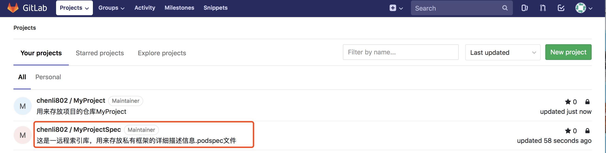

### 2.2 创建本地的私有索引库文件夹，并与远程私有索引库进行关联

#### 2.2.1 在终端中输入：<u>*pod repo*</u> （作用：查看本地已存在的索引库，我的电脑里已存在7个本地索引库，每个人的电脑不一样。）

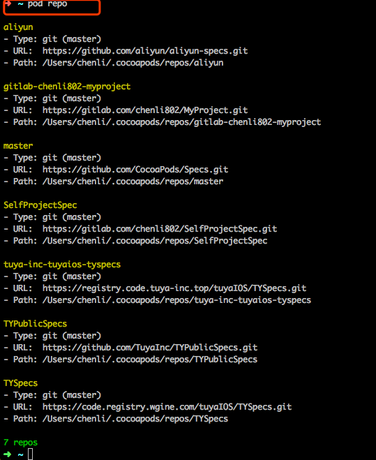

#### 2.2.2  *pod repo add MyProjectSpec https://gitlab.com/chenli802/MyProjectSpec.git* [替换成自己的索引库名，git地址，详见下图]   (作用：添加本地私有索引库并与远程私有库进行关联)

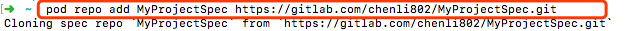

#### 2.2.3 <u>*pod repo*</u> (再次查看本地索引库，查看是否添加本项目的索引库)

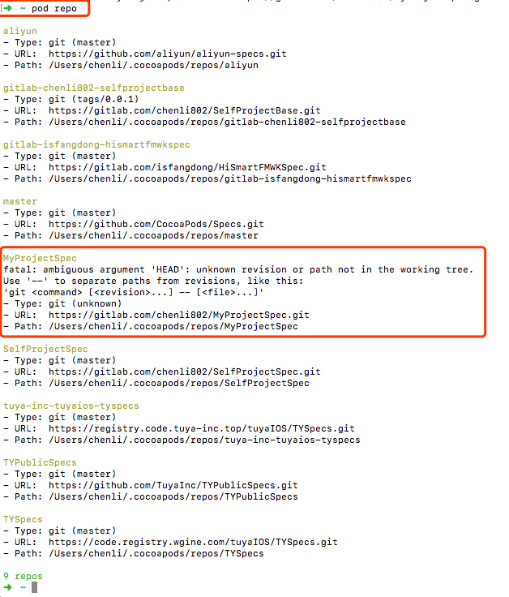

### 2.3 在gitlab上创建一个用来存放项目的仓库MyProject（这个项目，我们已经帮你们创建好了的）

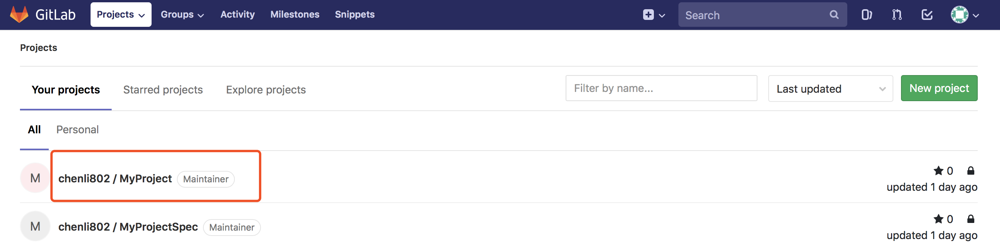

### 2.4 快速创建工程

#### 2.4.1 首先选择一个地址用来存放该项目，进入到项目要存放的路径下：我选择放在桌面上：*<u>cd /Users/chenli/Desktop</u>*,  ( chenli —>替换成自己的电脑用户名)，然后*<u>pod lib create MyProject --template-url=https://github.com/TuyaInc/pod-template.git</u>*（快速创建一个pod项目,MyProject ->替换成自己的项目名）

#### 2.4.2 删掉默认生成的Replace.m文件，在Classes文件中至少创建一个文件（如默认生成的MyProjectImpl.h和MyProjectImpl.m文件），使得Classes文件不为空，不然后面提交不上去，再cd回到该项目的*<u>Example文件</u>*路径下(*<u>cd /Users/chenli/Desktop/MyProject/Example</u>* )，重新执行*<u>pod install</u>*操作

##### 新建.h和.m文件：

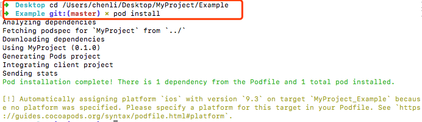

### 2.5 将上面的项目工程，提交到第2.3步创建的远程代码仓库MyProject，具体步骤如下：

- *<u>cd /Users/chenli/Desktop/MyProject</u>*   (进入到项目文件夹)
- *<u>git status</u>* （查看更改的文件）
- *<u>git add -A</u>* （add 后面有空格，大写A,提交增加，删除，修改的全部信息）
- *<u>git commit -m '创建项目工程'</u>*   

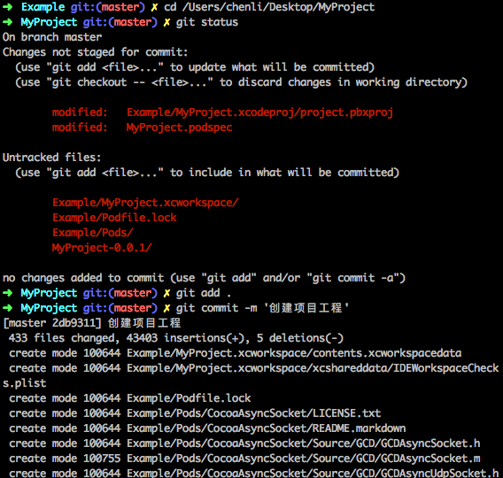

- 编辑MyProject项目工程里的MyProject.podspec文件 （development pods->MyProject->pod->MyProject.podspec）

  

  - tag：建议一开始为0.0.1

  - summary写项目的简要说明

  - source写该项目的gitlab地址，参考第2.2.2步

  - source_files :放源程序，不能为空

  - 本项目依赖的官方提供的 framework，没需要可以不写：

      s.framework    = 'CoreData'

  - 本项目被其他工程引入时，会导入MyProject/Classes 目录下的.h和.m文件

      s.source_files = 'MyProject/Classes/**/*' 

  -  本项目被其他工程引入时，会导入MyProject/Assets 目录下的资源文件，如果资源文字暂时没有的话，要隐藏这句话，不然会提交不上去：

  ​        s.resources = ['MyProject/Assets/*.{png,xib,plist,xcassets,bundle}'] 

  - 代码中包含静态库：

    s.vendored_libraries = '/Pod/Classes/*.a'

  - 该项目所依赖的其他库,比如：

     s.dependency  'AFNetworking', '~> 2.3'

     s.dependency  'MBProgressHUD '

  

  

  

  

  

  

- <u>*pod lib lint*</u> （验证上一步编辑的 MyProject.podspec文件）

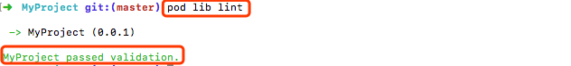

- *<u>git status</u>*
- <u>*git add -A*</u>
- <u>*git commit -m '编辑spec文件'*</u>
- <u>*git remote add origin https://gitlab.com/chenli802/MyProject.git*</u> (将本地库与远程代码仓库进行关联，git地址换成自己的)
- <u>*git push origin master*</u>  (提交到远程仓库)
- <u>*git tag '0.0.1'*</u>  (要与MyProject.podspec文件中的tag值保持一致)
- <u>*git push --tags*</u> (将tag提交到远程)
- <u>*pod spec lint --allow-warnings*</u>（验证远程是否正确）

### 2.6 <u>*pod repo push MyProjectSpec MyProject.podspec*</u> （将podspec文件提交到远程的私有索引库）

表示提交成功，此时远程私有库到此就已结束

注意：提交后，依然会验证 podspec文件，验证通过后 会自动上传到在远程spec索引库,不信的话你可以看看在第2.1步创建的Spec远程私有索引库，是不是多了一个[MyProject/ 0.0.1]文件！

### 2.7 添加及修改项目工程的内容，比如创建新的.h.m文件，添加依赖库

#### 2.7.1 添加.h和.m文件（要创建在Classes文件夹中，因为在podspec文件中指明了：  			   s.source_files = 'MyProject/Classes/**/*' ,[本项目被其他工程引入时，会导入MyProject/Classes 目录下的.h和.m文件]）

- #### 修改好之后，需要重新提交到远程，需要tag 加1:

- *<u>cd /Users/chenli/Desktop/MyProject</u>*   (进入工程文件夹)

- *<u>git status</u>* 

- *<u>git add .</u>*  

- *<u>git commit -m '添加及修改项目工程 '</u>*

- *<u>git push origin master</u>* 

- <u>*git tag '0.0.2'*</u>  (要与MyProject.podspec文件中的tag值保持一致)

- *<u>git push --tags</u>* 

    

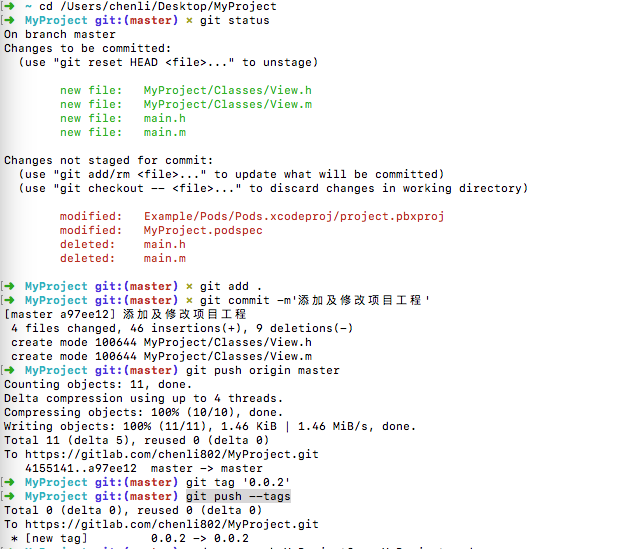

- *<u>pod repo push MyProjectSpec MyProject.podspec</u>*  （更新远程索引库）

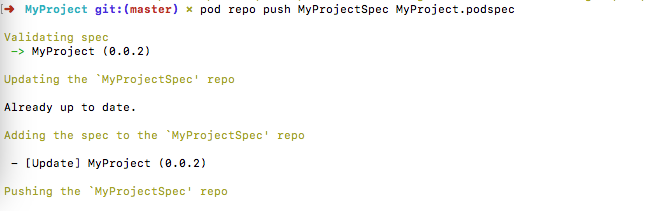

#### 2.7.2 添加framework：

#####     第一种：直接引用系统提供的.framework

 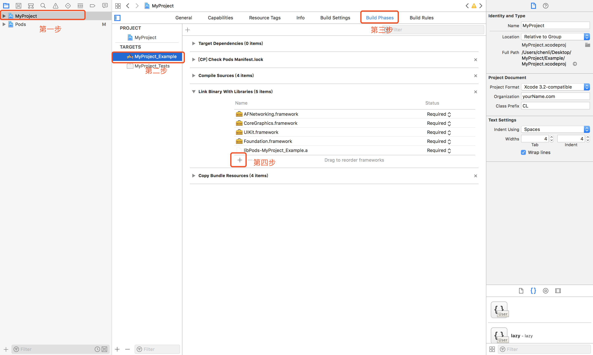

#####    第二种：引用第三方提供的.framework

- 下载好所需要的第三方提供的.framework

- 将第三方.framework文件拷贝到工程所处的Classes文件夹中

  

  

- 在Link Binary With Libraries中添加

  

  

  

  

#####    第三种：通过Cocoapods来导入.framework

- 在Podfile文件中，写入你需要导入的.framework文件的名字，如 pod 'XXXXXX'
- 执行pod安装命令：pod install

 

#### 修改好之后，要提交代码至远程，参考2.7.1

#### 2.7.3 现在我们来添加图片等资源文件：

- ##### 将图片等资源添加到Assets文件中

  

  

  

- ##### 修改podspec文件，添加这句话：

  s.resources = ['MyProject/Assets/*.{png,xib,plist,xcassets,bundle}'] 

  

- ##### 提交代码至远程，参考2.7.1

  